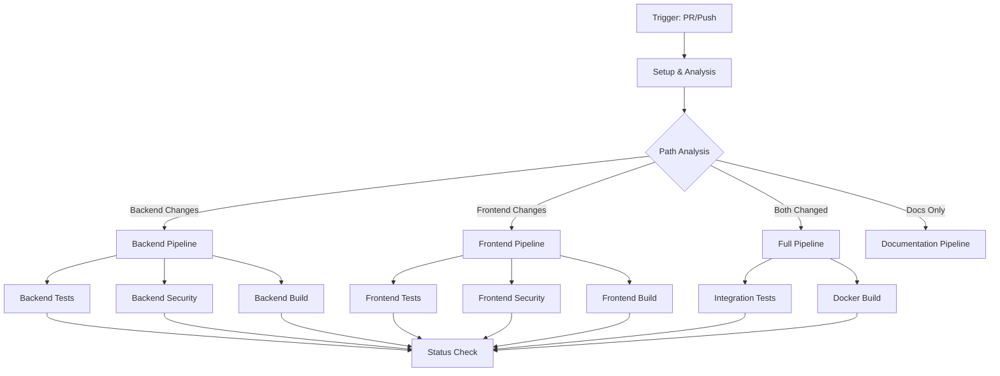
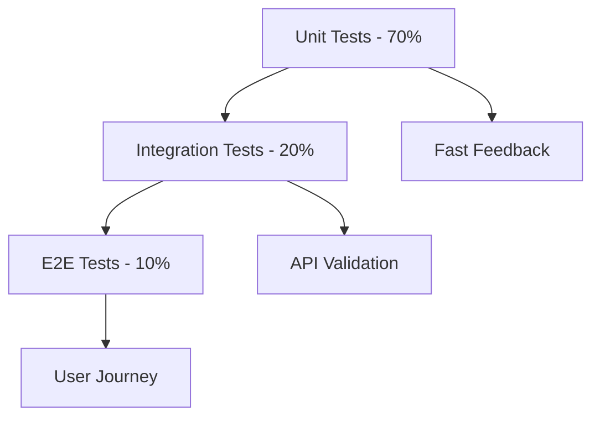

# CI Pipeline Design Document

## Overview

This design implements a comprehensive GitHub Actions-based CI pipeline for GreaterWMS, a Django-based warehouse management system with Vue.js/Quasar frontend. The pipeline follows modern DevOps practices with parallel job execution, intelligent path-based triggering, comprehensive security scanning, and optimized caching strategies.

The design addresses the dual-stack nature of the project (Python backend + Node.js frontend) while maintaining fast feedback loops and cost-effective resource usage through smart job orchestration.

## Architecture

### Pipeline Structure



### Job Matrix Strategy

The pipeline uses a matrix strategy for comprehensive testing across multiple environments:

- **Python Versions**: 3.9, 3.10, 3.11
- **Node.js Versions**: 16.x, 18.x, 20.x
- **Operating Systems**: ubuntu-latest, windows-latest (for critical paths)
- **Database**: SQLite (development), PostgreSQL (integration tests)

## Components and Interfaces

### 1. Trigger and Path Detection Component

**Purpose**: Intelligently determine which parts of the pipeline to execute based on changed files.

**Interface**:
```yaml
inputs:
  - github.event (webhook payload)
  - changed_files (git diff output)
outputs:
  - run_backend: boolean
  - run_frontend: boolean
  - run_integration: boolean
  - run_docs_only: boolean
```

**Logic**:
- Backend triggers: `*.py`, `requirements.txt`, `Dockerfile`, `manage.py`, Django apps
- Frontend triggers: `templates/**`, `app/**`, `*.js`, `*.vue`, `package.json`
- Documentation triggers: `*.md`, `docs/**`, `.github/**`

### 2. Backend Quality Assurance Component

**Purpose**: Ensure Python code quality, security, and functionality.

**Sub-components**:

#### Code Quality Module
```yaml
tools:
  - flake8: Style and syntax checking
  - black: Code formatting validation
  - isort: Import sorting validation
  - mypy: Static type checking
  - bandit: Security linting
```

#### Testing Module
```yaml
test_types:
  - unit_tests: Django test suite
  - integration_tests: API endpoint testing
  - model_tests: Database model validation
  - view_tests: HTTP response validation
```

#### Security Scanning Module
```yaml
scanners:
  - safety: Python dependency vulnerability scanning
  - pip-audit: Alternative dependency scanner
  - semgrep: Static application security testing
  - CodeQL: GitHub's semantic code analysis
```

### 3. Frontend Quality Assurance Component

**Purpose**: Ensure JavaScript/Vue.js code quality and security.

**Sub-components**:

#### Code Quality Module
```yaml
tools:
  - eslint: JavaScript/Vue linting
  - prettier: Code formatting validation
  - vue-tsc: TypeScript checking (if applicable)
```

#### Testing Module
```yaml
test_types:
  - unit_tests: Jest/Vitest component tests
  - lint_tests: Code style validation
  - build_tests: Quasar build validation
```

#### Security Scanning Module
```yaml
scanners:
  - npm_audit: Node.js dependency scanning
  - retire.js: JavaScript library vulnerability detection
```

### 4. Docker Build and Validation Component

**Purpose**: Build and validate Docker images for both backend and frontend.

**Interface**:
```yaml
inputs:
  - dockerfile_path: string
  - build_context: string
  - target_stage: string
outputs:
  - image_id: string
  - image_size: number
  - security_scan_results: object
```

**Features**:
- Multi-stage build optimization
- Layer caching with GitHub Actions cache
- Security scanning with Trivy
- Image size monitoring and alerts

### 5. Caching and Optimization Component

**Purpose**: Minimize build times through intelligent caching.

**Cache Strategies**:

#### Python Dependencies
```yaml
cache_key: pip-${{ runner.os }}-${{ hashFiles('requirements.txt') }}
paths:
  - ~/.cache/pip
  - .venv/
```

#### Node.js Dependencies
```yaml
cache_key: npm-${{ runner.os }}-${{ hashFiles('**/package-lock.json') }}
paths:
  - ~/.npm
  - node_modules/
  - templates/node_modules/
```

#### Docker Layers
```yaml
cache_key: docker-${{ runner.os }}-${{ hashFiles('Dockerfile') }}
registry: ghcr.io
```

## Data Models

### Pipeline Configuration Model

```yaml
pipeline_config:
  triggers:
    - push: [main, develop]
    - pull_request: [main, develop]
    - schedule: "0 2 * * 1"  # Weekly security scan
  
  timeouts:
    default_job: 30m
    security_scan: 45m
    docker_build: 20m
  
  retry_policy:
    max_attempts: 2
    retry_on: [failure]
    exclude_steps: [security_scan]
```

### Quality Gates Model

```yaml
quality_gates:
  required_checks:
    - backend_tests
    - frontend_lint
    - security_scan
    - docker_build
  
  optional_checks:
    - performance_test
    - accessibility_test
  
  failure_thresholds:
    test_coverage: 80%
    security_severity: medium
    build_time: 15m
```

### Notification Model

```yaml
notifications:
  slack:
    webhook_url: ${{ secrets.SLACK_WEBHOOK }}
    channels:
      - dev-alerts
      - security-alerts
  
  github:
    status_checks: true
    pr_comments: true
    issue_creation: true
```

## Error Handling

### Failure Recovery Strategies

1. **Transient Failures**: Automatic retry with exponential backoff
2. **Dependency Failures**: Fallback to cached versions when possible
3. **Network Failures**: Retry with different mirrors/registries
4. **Resource Exhaustion**: Queue jobs and retry with increased resources

### Error Classification

```yaml
error_types:
  critical:
    - security_vulnerabilities_high
    - test_failures
    - build_failures
  
  warning:
    - security_vulnerabilities_medium
    - code_quality_issues
    - performance_degradation
  
  info:
    - dependency_updates_available
    - optimization_suggestions
```

### Rollback Mechanisms

- **Failed Deployments**: Automatic rollback to last known good state
- **Corrupted Cache**: Cache invalidation and rebuild
- **Security Issues**: Immediate pipeline halt and notification

## Testing Strategy

### Test Pyramid Implementation



### Backend Testing Approach

1. **Unit Tests**: Django model and view testing
2. **Integration Tests**: API endpoint testing with test database
3. **Security Tests**: Authentication and authorization validation
4. **Performance Tests**: Database query optimization validation

### Frontend Testing Approach

1. **Component Tests**: Vue component unit testing
2. **Integration Tests**: API integration testing
3. **Build Tests**: Quasar build process validation
4. **Accessibility Tests**: WCAG compliance checking

### Docker Testing Strategy

1. **Build Tests**: Multi-stage build validation
2. **Security Tests**: Container vulnerability scanning
3. **Runtime Tests**: Basic smoke tests in container environment
4. **Size Tests**: Image size optimization validation

## Performance Optimization

### Parallel Execution Strategy

```yaml
job_dependencies:
  setup: []
  backend_lint: [setup]
  backend_test: [setup]
  backend_security: [setup]
  frontend_lint: [setup]
  frontend_test: [setup]
  docker_build: [backend_test, frontend_test]
  integration_test: [docker_build]
```

### Resource Allocation

- **Standard Jobs**: 2 CPU, 7GB RAM
- **Build Jobs**: 4 CPU, 14GB RAM
- **Security Scans**: 2 CPU, 7GB RAM (longer timeout)

### Cache Optimization

1. **Dependency Caching**: Aggressive caching of pip and npm packages
2. **Docker Layer Caching**: Registry-based layer caching
3. **Build Artifact Caching**: Intermediate build results
4. **Test Result Caching**: Skip unchanged test suites

## Security Considerations

### Secrets Management

```yaml
secrets_required:
  - GITHUB_TOKEN: Repository access
  - SLACK_WEBHOOK: Notification delivery
  - DOCKER_REGISTRY_TOKEN: Image publishing
  - SECURITY_SCAN_TOKEN: Third-party security services
```

### Security Scanning Pipeline

1. **Dependency Scanning**: Known vulnerability detection
2. **Static Analysis**: Code security pattern detection
3. **Container Scanning**: Docker image vulnerability assessment
4. **License Compliance**: Open source license validation

### Access Control

- **Branch Protection**: Require CI checks before merge
- **Review Requirements**: Mandatory code review for security-sensitive changes
- **Audit Logging**: Complete pipeline execution logging

## Monitoring and Observability

### Metrics Collection

```yaml
metrics:
  pipeline_duration: histogram
  test_success_rate: gauge
  security_scan_findings: counter
  cache_hit_rate: gauge
  resource_utilization: histogram
```

### Alerting Strategy

1. **Immediate Alerts**: Critical security vulnerabilities, build failures
2. **Daily Summaries**: Test coverage trends, performance metrics
3. **Weekly Reports**: Security posture, dependency updates

### Dashboard Integration

- **GitHub Actions**: Native workflow visualization
- **Third-party Tools**: Integration with monitoring platforms
- **Custom Dashboards**: Project-specific metrics visualization